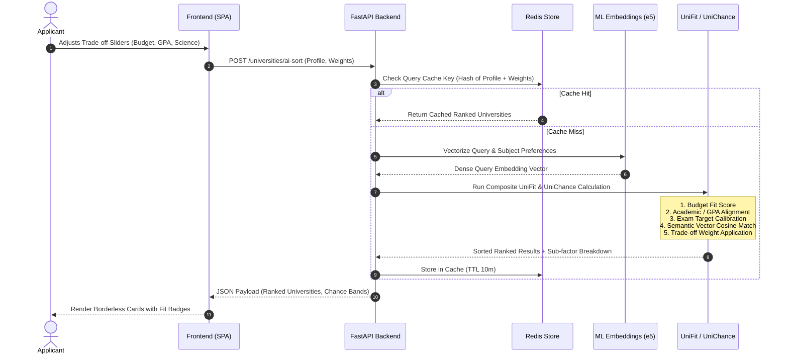

# UniSearch System Architecture

This document provides a comprehensive overview of the UniSearch technical architecture, system components, data flows, and security model.

---

## 1. System Overview & Component Topology

UniSearch is designed as a focused, high-performance academic search and recommendation engine. It pairs a borderless, lightweight vanilla JavaScript frontend (no heavy framework overhead) with a high-throughput Python FastAPI microservice, backed by in-memory Redis caching, neural semantic embeddings, and verified institutional datasets.

```mermaid
flowchart TD
    subgraph Client ["Client Layer (Browser)"]
        UI["Calm Academic UI\n(HTML5, Vanilla ES Modules, CSS Tokens)"]
        State["State Management\n(LocalStorage, URL Routing, SafeStorage)"]
        I18N["Client-side Localization\n(Dynamic EN / RU via i18n.js)"]
    end

    subgraph Gateway ["Edge / Reverse Proxy Layer"]
        Proxy["Reverse Proxy / CDN\n(TLS 1.2+, HTTPS Termination, Host Guard)"]
    end

    subgraph Backend ["Application Layer (FastAPI)"]
        MW["Security Middleware\n(Rate Limiter, Body Limit, CSP, Proxy Guard)"]
        Routers["API Routers\n(/universities, /ai-sort, /compare, /exams)"]
        UniFit["UniFit Composite Engine\n(Personalized Ranking, Sliders)"]
        UniChance["UniChance Estimator\n(Admissions Probability Engine)"]
        ML["ML Semantic Service\n(multilingual-e5 Embeddings, Vector Cosine)"]
    end

    subgraph Persistence ["Data & Cache Layer"]
        Redis[("Redis In-Memory Cache\n(Query cache, Ping cache, Fallback safe)")]
        Disk[("Verified JSON Catalog\n(50 Institutions, Criteria, Programs)")]
        Media[("Media Assets\n(1:1 PNG Logos, 16:9 WebP Thumbnails)")]
    end

    UI <--> |HTTP / JSON over HTTPS| Proxy
    Proxy <--> |Reverse Proxy (127.0.0.1:8000)| MW
    MW --> Routers
    Routers --> UniFit
    Routers --> UniChance
    UniFit <--> ML
    Routers <--> Redis
    Routers --> Disk
    Routers --> Media
```

---

## 2. Frontend Layer (Calm Academic Workspace)

The frontend is implemented purely in standards-compliant **Vanilla JavaScript (ES Modules)**, HTML5, and semantic CSS3. It deliberately avoids UI framework bloat (React/Vue/Angular), resulting in instant first-contentful paint (< 200ms) and minimal memory consumption.

### Key Architectural Modules

* **Router & Page Controller (`frontend/javascript/routes.js`):**
  Manages single-page application (SPA) routing, browser history (`pushState` / `popstate`), query parameter synchronization, and viewport lifecycle transitions.
* **Global Search Component (`frontend/javascript/components/navbar-search.js`):**
  Provides a debounced (180ms) autocomplete typeahead with keyboard navigation (arrow keys, Enter, Escape), matched alias badges, network status monitoring, and full mobile drawer overlay.
* **Localization Subsystem (`frontend/javascript/i18n.js`):**
  Dynamic client-side internationalization supporting English and Russian without full page reloads. Strings are loaded from `frontend/Localization/` with a fallback key mechanism.
* **State Persistence (`frontend/javascript/utils/persistence.js` & `safe-storage.js`):**
  Safely syncs applicant preferences (GPA, exam scores, budget, currency choices, comparison trays) to browser `localStorage` with migration versioning and corrupted JSON recovery.
* **Design System & Styling (`frontend/css/style.css`):**
  Adheres strictly to the **Calm Academic Workspace** specification (`docs/design-system.md`):
  - **Borderless by default:** Components use semantic surface shifts (`--bg` → `--surface-solid` → `--surface-soft`) and micro-elevation (`--shadow-xs`) rather than box borders.
  - **4/8-px spacing scale:** Strict layout rhythm without arbitrary margin/padding offsets.
  - **Theming:** Clean Light and Dark modes driven by CSS variables at the `:root` level, meeting WCAG 2.2 AA contrast standards.

---

## 3. Backend Layer (FastAPI Microservice)

The backend is built with **Python 3.12+ and FastAPI**, leveraging asynchronous event loops (ASGI) and strict type validation via Pydantic V2.

```
backend/app/
├── core/
│   ├── security.py       # Sliding-window rate limiter, proxy resolution, CSP headers
│   ├── redis_store.py    # Robust Redis client with automatic fallback suppression
│   ├── settings.py       # Pydantic BaseSettings with typed environment overrides
│   └── observability.py   # Metrics collection, request duration tracking, structured logging
├── routers/
│   ├── universities.py   # Core catalog, search, AI sort, ROI, and comparisons
│   ├── exams.py          # Standardized exam validation & scoring bounds
│   ├── languages.py      # Language proficiency framework mappings
│   └── root.py           # Health probes (/health, /ready), ops admin endpoints
├── schemas/
│   └── payloads.py       # Pydantic V2 request & response contracts
└── services/
    ├── ai_scoring.py     # UniFit composite personalized ranking & UniChance algorithms
    ├── ml_scoring.py     # Multilingual neural embeddings & semantic vector search
    ├── search.py         # Multi-criteria filtering, fuzzy normalization & sorting
    └── background_tasks.py # Async startup sync, currency warmup, ML model initialization
```

### Request Lifecycle & Defense-in-Depth Pipeline

1. **Host Header Validation:** Discards requests with unapproved hostnames.
2. **Payload Size Guard:** Rejects incoming request bodies exceeding 128 KiB (`REQUEST_BODY_MAX_BYTES`) with HTTP 413.
3. **Client IP Resolution (`request_client_ip`):** Evaluates `X-Forwarded-For` right-to-left against configured `TRUSTED_PROXY_IPS` and private network ranges, rejecting client-spoofed headers.
4. **Sliding-Window Rate Limiter:** Enforces IP-based rate limits (global requests and expensive calculation budgets) using memory-safe sliding window counters.
5. **Contract Enforcement:** Request payloads are deserialized and strictly validated against Pydantic models in `backend/app/schemas/payloads.py`. Invalid parameters trigger structured HTTP 422 errors.
6. **Security Headers Middleware:** Injects defensive headers into every HTTP response:
   - `Content-Security-Policy (CSP)`
   - `X-Content-Type-Options: nosniff`
   - `X-Frame-Options: DENY`
   - `Referrer-Policy: strict-origin-when-cross-origin`

---

## 4. Scoring & Intelligence Engine

UniSearch separates calculated heuristic proxies from verified facts. Its core decision engine comprises two complementary algorithmic systems:



### A. UniFit (Composite Personalized Ranking)
Implemented in `backend/app/services/ai_scoring.py`, UniFit generates a normalized score ($0.0 - 100.0$) tailored to an individual applicant profile:
* **Academic Fit:** Evaluates GPA and standardized test scores (SAT, ACT, IELTS, TOEFL, TestDaF) against verified institutional quartiles (25th–75th percentiles). Missing test scores are handled conservatively without false-zero penalties.
* **Financial Fit:** Compares total cost of attendance (tuition, fees, living costs) against applicant budget, factoring in merit scholarships and state grant programs.
* **Trade-off Sliders:**
  - *Budget vs. Prestige:* Balances tuition sensitivity against global/national university reputation.
  - *Practice vs. Science:* Shifts weight between research activity/PhD density and internship/industry placement rates.
  - *Social vs. Hardcore:* Balances student satisfaction/life ratings against academic selectivity and grading rigor.
* **Language Compatibility:** Analyzes required instruction languages against applicant certified language proficiencies.

### B. UniChance (Admissions Probability Calibration)
UniChance computes non-linear admissions probability bands:
* **Low / Reach (< 25%):** Applicant credentials fall below the institution's 25th percentile.
* **Target / Competitive (25% - 70%):** Applicant credentials match institutional median profiles.
* **Safe / High (> 70%):** Applicant credentials exceed the 75th percentile with confirmed high historical yield.
* *Integrity Rule:* Without verified institutional admission profiles, the system returns `estimated_fallback` or `no_estimate`. Proxies are never misrepresented as verified guarantees.

### C. ML Semantic Matching (`multilingual-e5`)
Implemented in `backend/app/services/ml_scoring.py`:
* Leverages dense neural sentence embeddings via `intfloat/multilingual-e5-small`.
* Enables multilingual semantic query expansion (e.g. an applicant querying in Russian or Kazakh naturally matches English and German program descriptions).
* **Fault-Tolerant Mode:** If neural models or PyTorch are disabled (`ML_SEMANTIC_EMBEDDINGS_ENABLED=0`) or unavailable in restricted container environments, the engine seamlessly reports `unavailable` mode and relies on deterministic lexical ranking without silent degradation.

---

## 5. Data Architecture & Caching Strategy

### Data Storage Model
* **Authoritative Catalog (`backend/data/`):**
  Stored as structured, normalized JSON files under source control. Every university entry contains verified data points: metadata, geographic coordinates, admissions requirements, tuition schedules, study modes, and language requirements.
* **Asset Directory (`backend/data/university_assets/`):**
  - Institutional logos: 1:1 square PNG format with responsive fallbacks.
  - Campus thumbnails: 16:9 WebP and JPEG images generated in multiple responsive resolutions.
* **Data Auditing (`npm run audit:data`):**
  Automated script validating schema conformance, URL liveliness, required fields, and asset presence before any release.

### Redis Caching Layer (`app/core/redis_store.py`)
* **Environment-Isolated Key Namespaces:** All cache keys are dynamically prefixed with deployment environments (e.g. `unisearch:prod:`, `unisearch:test:`).
* **Graceful Failure Suppression:** Redis errors (connection timeouts, cluster restarts) are trapped and logged without bubbling to the client. The system transparently falls back to computing fresh responses.
* **Ping Caching:** Connection liveness is cached for 10 seconds to eliminate redundant network roundtrips during health probes.

---

## 6. Observability, Health & Startup Lifecycle

UniSearch provides fine-grained observability for production hosting:

* **`/health`:** Lightweight liveness check for load balancers. Returns HTTP 200 with system uptime.
* **`/ready`:** Readiness probe validating catalog data load, Redis connectivity, and embedding model availability.
* **`/metrics`:** Exposes Prometheus-compatible operational counters: request counts, duration histograms, cache hit/miss ratios, and rate-limit triggers.
* **`/ops/*` (Ops Admin Endpoints):** Protected administrative endpoints requiring `OPS_ADMIN_TOKEN` for on-demand cache flushing, catalog reload, and runtime diagnostics.
* **Background Startup Synchronization (`app/services/background_tasks.py`):**
  Upon application start, an asynchronous warmup routine loads the catalog into memory, primes currency conversion tables from open exchange rate feeds, and initializes ML vector indices in the background without blocking initial HTTP readiness.

---

## 7. Verification & Testing Strategy

The repository enforces progressive, layered testing:

| Test Layer | Framework | Scope | Coverage / SLA |
| --- | --- | --- | --- |
| **Backend Unit & API** | Python `unittest` + `TestClient` | Routers, UniFit scoring, Redis store, security middleware, schemas | **85% Statement**, **81% Branch** |
| **Frontend Unit** | Node.js Test Runner (V8) | Formatting, search autocomplete, i18n, persistence, DOM events | **80.15% Line Coverage** |
| **E2E Integration** | Playwright (Chromium) | Full browser journeys, filters, compare tray, light/dark themes | Automated on every PR |
| **Security SAST** | GitHub CodeQL | Python & JavaScript vulnerability scanning | Automated CI scan |
| **Container & Secret Scan** | Aqua Security Trivy | Container image vulnerabilities and secret leaks | Automated CI scan |
| **Fuzz Testing (DAST)** | Google ClusterFuzzLite / Atheris | Continuous fuzzing of scoring engines and input parsers | Automated CI fuzzing |
| **Design Integrity** | Custom Token Linter | Zero hardcoded colors; strict borderless design system tokens | 0 violations baseline |
