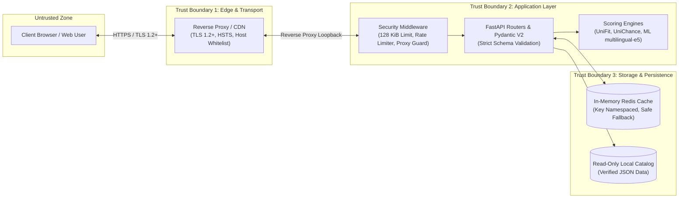

# UniSearch Security Assurance Case

This document establishes the formal **Security Assurance Case** for the UniSearch project, satisfying the **OpenSSF Best Practices Silver Badge** criterion `assurance_case`.

Following NIST IR 7608 and OpenSSF guidelines, this document articulates our threat model, delineates explicit trust boundaries, demonstrates the application of secure design principles, and details defense-in-depth countermeasures against common software vulnerabilities.

---

## 1. Context and Threat Model

UniSearch is an open-source academic search and recommendation engine helping applicants discover bachelor's degree programs. The system architecture comprises a vanilla JavaScript frontend, a high-throughput Python (FastAPI) microservice, in-memory Redis caching, neural semantic scoring (`multilingual-e5`), and an authoritative JSON data repository.

### 1.1 Asset Inventory & Critical Claims
* **Asset 1: Data Integrity of the University Catalog.** The institutional information (tuition, admissions criteria, deadlines) must remain accurate, verified, and tamper-proof.
* **Asset 2: Service Availability & Computational Resilience.** Personalized AI ranking (`UniFit`) and semantic vector lookups must be resilient against denial-of-service, resource exhaustion, and algorithmic complexity attacks.
* **Asset 3: Applicant Privacy.** Applicant academic metrics (GPA, test scores, financial budgets, saved institutions) belong exclusively to the applicant and must never be leaked, harvested, or transmitted to third parties without consent.
* **Asset 4: Administrative Operations.** Operations endpoints (`/ops/*`) must be strictly inaccessible to unauthorized clients.

### 1.2 Threat Actors & Threat Scenarios
1. **Automated Scrapers & DoS Attackers:** Malicious bots attempting to overwhelm the scoring algorithms or starve application memory via high-frequency or oversized search payloads.
2. **Untrusted Web Clients:** Attackers injecting malicious query parameters or payloads attempting Cross-Site Scripting (XSS), prototype pollution, or payload buffer overflows.
3. **Supply Chain Attackers:** Compromised third-party Python packages or JavaScript dependencies introducing vulnerabilities or backdoors.
4. **Network Eavesdroppers:** Adversaries attempting to intercept or modify traffic between the client, reverse proxy, or upstream dependency endpoints.

---

## 2. Trust Boundaries and Data Flow

* **Trust Boundary 1 (Client to Edge):** All incoming client requests originate from an untrusted network. The Edge layer terminates TLS (minimum TLS 1.2), validates Host headers, and mitigates volumetric attacks before traffic reaches the backend application.
* **Trust Boundary 2 (Edge to Application):** FastAPI middleware enforces strict IP resolution from trusted reverse proxy headers, inspects payload size caps (128 KiB limit), and enforces rate-limiting before dispatching to endpoint controllers.
* **Trust Boundary 3 (Application to Storage):** The data layer holds authoritative institutional data. The application maintains read-only access to source JSON files under version control; no untrusted write operations or arbitrary shell execution are allowed against persistent storage.

---

## 3. Secure Design Principles

UniSearch applies fundamental secure design principles across every layer:

1. **Least Privilege & Isolation:**
   * Backend Docker containers execute as an unprivileged, non-root user.
   * File access to the university catalog (`backend/data/`) is read-only at runtime.
   * Operations endpoints (`/ops/*`) require an explicit `OPS_ADMIN_TOKEN` secret.
2. **Defense in Depth:**
   * Multiple concentric verification layers: Edge TLS termination → Body size middleware → Sliding-window rate limiting → Pydantic V2 strict type validation → Domain engine boundary bounds checking.
3. **Fail-Safe Defaults & Graceful Degradation:**
   * If Redis is unreachable, the system automatically falls back to in-memory computation without crashing or failing requests (`app/core/redis_store.py`).
   * If neural embeddings or PyTorch are disabled (`ML_SEMANTIC_EMBEDDINGS_ENABLED=0`) or unavailable, the system reports `unavailable` mode without silently substituting lexical results.
4. **Stateless Privacy-First Architecture:**
   * UniSearch maintains zero server-side user sessions, zero passwords, and zero personal applicant profiles in databases.
   * User applicant profiles and favorites live exclusively in client-side browser `localStorage` and are never harvested into a central database.
5. **Complete Mediation:**
   * Every incoming HTTP request is intercepted and validated by uniform security middleware before touching application logic.

---

## 4. Countermeasures Against Common Implementation Weaknesses

| Vulnerability Class (OWASP) | Risk in UniSearch | Mitigation & Implementation Countermeasure |
| --- | --- | --- |
| **A01: Broken Access Control** | Unauthorized execution of management tasks | Public endpoints are strictly read-only catalog queries. Ops endpoints (`/ops/*`) require constant-time comparison against `OPS_ADMIN_TOKEN`. |
| **A02: Cryptographic Failures** | Data exposure in transit | Transport security is strictly enforced over HTTPS (TLS 1.2/1.3). Outbound HTTP requests use standard certificate verification (via Python `certifi`). |
| **A03: Injection (SQLi, Command Injection)** | Query tampering | **Zero SQL usage:** UniSearch does not use a relational SQL engine; catalog data is stored in immutable JSON. Incoming parameters are parsed and strongly typed via Pydantic V2 schemas. No dynamic `eval()` or shell subprocess execution on user input. |
| **A04: Insecure Design** | Architectural flaws | Documented system architecture (`docs/architecture.md`), RFC process for major changes (`GOVERNANCE.md`), and strict bachelor-only product boundary. |
| **A05: Security Misconfiguration** | Information leakage, bad headers | Defensive HTTP headers attached on every response: `Content-Security-Policy: default-src 'self'`, `X-Content-Type-Options: nosniff`, `X-Frame-Options: DENY`. Debug flags disabled in production environments. |
| **A06: Vulnerable & Outdated Components** | Known CVEs in dependencies | Continuous dependency monitoring with Dependabot, blocking npm and Python dependency audits, and static code analysis with **GitHub CodeQL**. **Aqua Security Trivy** separately scans the repository filesystem for secrets and configuration issues. |
| **A07: Identification & Auth Failures** | Credential stuffing, brute force | **Not Applicable to End Users:** UniSearch does not store user passwords, emails, or personal accounts. Local preferences remain in the user's browser. |
| **A08: Software & Data Integrity Failures** | Malicious packages, untrusted releases | Pinned dependency locks (`package-lock.json`, exact version requirements in `requirements.txt`). Cryptographic attestation of releases via GitHub Sigstore (`actions/attest-build-provenance`). |
| **A09: Security Logging & Monitoring** | Undetected attacks or downtime | Structured logging with correlation IDs, latency tracking, Prometheus metrics endpoint (`/metrics`), and health/readiness probes (`/health`, `/ready`). Sensitive variables and auth tokens are masked from all logs. |
| **A10: Server-Side Request Forgery (SSRF)** | Internal network probing | The backend does not fetch arbitrary user-supplied URLs. External requests are limited to pre-configured official institutional sites and open exchange rate feeds. |
| **Client-Side Cross-Site Scripting (XSS)** | Malicious script execution in browser | The Calm Academic Workspace frontend uses Vanilla JS with safe DOM manipulation (`textContent`, programmatic node construction) and strict sanitization. CSP headers prohibit inline unsafe scripts. |
| **Denial of Service (DoS / Resource Exhaustion)** | Server overload | Request payload size strictly capped at 128 KiB; sliding-window rate limiting enforced per client IP; debounced frontend autocomplete search inputs (180ms). |

---

## 5. Security Verification & Continuous Assurance

To prove that the security claims remain valid through continuous evolution, the project mandates:

1. **Automated Static Analysis (SAST):**
   * GitHub CodeQL scans both Python and JavaScript codebases on every pull request and on a weekly scheduled cadence.
   * `pip-audit` scans Python dependencies for known CVEs.
   * `Trivy` scans the repository filesystem for exposed secrets and configuration misconfigurations; findings are uploaded to GitHub code scanning.
2. **Automated Coverage-Guided Fuzzing:**
   * Continuous fuzz testing integrated with **Google ClusterFuzzLite** and Atheris, fuzzing input parsing, JSON deserialization, and ranking computation engines against malformed or malicious inputs.
3. **High Statement & Branch Coverage:**
   * Automated unit, integration, and E2E test suites (Python `unittest`, Node.js test runner, Playwright) verifying scoring boundary conditions and error handling.
4. **Vulnerability Response & SLAs:**
   * Published policy in [SECURITY.md](../SECURITY.md) committing to **48-hour initial acknowledgment** and **14-day hotfix releases** for critical vulnerabilities, with public attribution in our Security Hall of Fame.

---

## 6. Conclusion and Claim Justification

The evidence presented in this assurance case confirms that UniSearch is architecturally shielded against untrusted inputs, respects user privacy through a stateless catalog design, enforces rigorous automated security testing, and maintains documented procedures for continuous vulnerability management in alignment with OpenSSF Silver standards.
